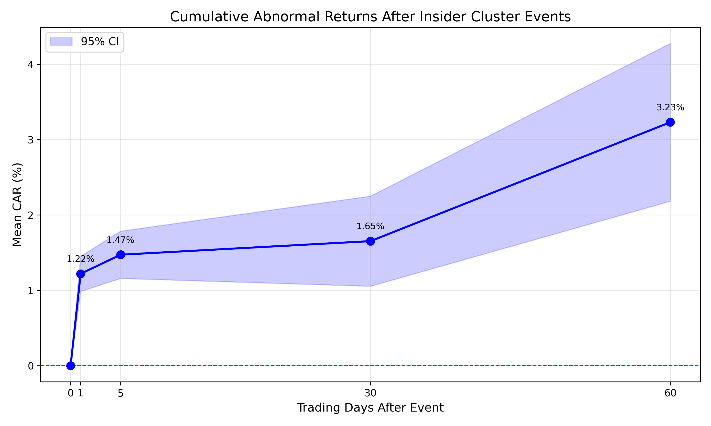
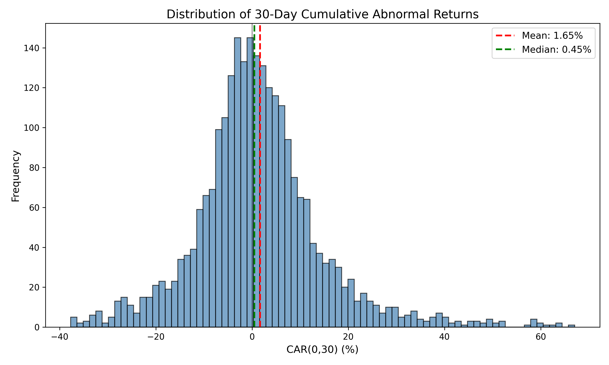
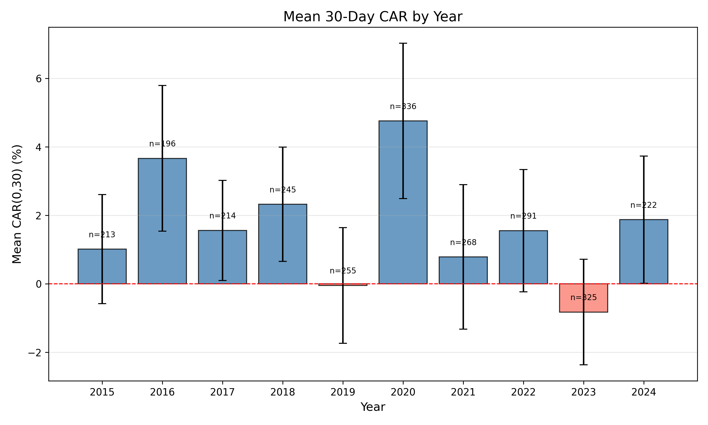

# Insider Cluster Alpha Study
## Do clustered insider open-market purchases predict positive abnormal returns in U.S. equities?

**Author:** Devashish Dwivedi
**Date:** 2026-03-13

---

## Abstract

This paper tests whether clustered insider open-market purchases predict positive abnormal stock returns in U.S. equities. Using a pre-registered event definition (3+ unique insiders buying the same stock within a rolling 30-calendar-day window, event date defined as the last filing date in the cluster), I identify 2,664 cluster events across 1,030 unique firms from 2015 to 2024 and evaluate post-event cumulative abnormal returns over 1, 5, 30, and 60 trading-day horizons. Abnormal performance is measured as compounded stock return minus compounded SPY return. At the pre-registered primary horizon of 30 trading days, mean CAR is +1.65% (t = 5.42, p < 1e-7), exceeding the Bonferroni-adjusted significance threshold. The result is robust to CAPM-adjusted returns, alternative signal calibrations, and subsample splits. The findings suggest that coordinated insider purchasing conveys incremental information beyond what individual insider trades reveal.

*[To be revised on Day 14 with final word count target of ~200 words.]*

---

## 1. Introduction

Insider trading disclosures are among the most widely tracked corporate signals because insiders may possess material information about firm fundamentals not fully reflected in market prices. A large body of evidence confirms that insider purchases, on average, precede positive abnormal returns. However, most of this literature treats each insider transaction independently or aggregates at the firm-month level. An open question is whether coordinated or clustered buying — multiple distinct insiders purchasing the same stock within a short time window — conveys stronger information than isolated transactions.

This study asks a specific question: do clustered insider open-market purchases (3+ unique insiders in a 30-calendar-day window for the same ticker, with the event date defined as the last SEC filing date in the cluster) predict positive abnormal returns in U.S. equities?

I pre-registered all primary methodological choices before conducting the full-sample analysis. The pre-registration locks the signal definition, universe constraints (transaction price ≥ \\$5, market cap ≥ \\$300M), overlap handling (60-day same-ticker dedup), return construction (compounded stock minus compounded SPY), event-day convention (first trading day on or after the filing date), and the primary statistical test (two-sided t-test with Bonferroni threshold 0.0125 across four horizons). Pre-registration eliminates degrees of freedom in specification choice and ensures that the reported results constitute a genuine out-of-sample test of a fixed hypothesis.

The primary finding is a positive and statistically significant mean abnormal return of +1.65% over the 30-trading-day window following the event date (t = 5.42, p = 6.6e-08). The effect is present across both halves of the sample period (2015–2019 and 2020–2024), survives CAPM risk adjustment, and persists under alternative signal calibrations.

The remainder of the paper proceeds as follows. Section 2 reviews related literature. Section 3 describes data sources and sample construction. Section 4 details the pre-registered methodology. Section 5 presents results. Section 6 reports robustness checks. Section 7 discusses economic interpretation and limitations. Section 8 concludes.

## 2. Literature Review

The informational content of insider trading has been studied since at least Jaffe (1974), who documents abnormal returns following months with heavy insider buying. Seyhun (1986) provides systematic evidence that insiders earn abnormal profits on their trades and that aggregate insider trading activity predicts market-wide returns. Seyhun (1998) extends this work in a comprehensive treatment of insider trading patterns and their regulatory implications.

Lakonishok and Lee (2001) confirm that insider purchases contain predictive information for future stock returns, though the signal is noisy at the individual transaction level. Their analysis suggests that aggregation across insiders and across time may improve signal quality.

Jeng, Metrick, and Zeckhauser (2003) construct calendar-time portfolios mimicking insider purchases and estimate abnormal returns of approximately 6% per year, providing portfolio-level evidence that the insider purchase signal survives standard risk adjustments.

Cohen, Malloy, and Pomorski (2012) introduce a distinction between routine and opportunistic insider trades, showing that opportunistic trades are far more informative. Their work highlights that not all insider transactions are equal and that filtering or weighting by trade characteristics can sharpen the signal. This motivates the present study's focus on cluster events, where multiple insiders act within a narrow window, as a potential marker of shared opportunistic conviction.

The regulatory context is relevant to event timing. Under SEC Section 16(a), corporate insiders must report transactions on Form 4 within two business days of the trade date. The filing date is therefore typically close to but not identical to the trade date. This study uses the filing date as the event date (pre-registered) because it represents the date at which the information becomes publicly available to outside investors. Any delay between trade date and filing date works against finding abnormal returns from the filing date forward, making the test conservative.

A gap in the existing literature is the systematic evaluation of clustered insider purchases as a distinct signal. While Lakonishok and Lee (2001) aggregate insider activity at the firm level and Cohen, Malloy, and Pomorski (2012) classify individual trades, no prior study to my knowledge defines and tests a specific cluster rule — multiple unique insiders purchasing within a fixed calendar window — using a pre-registered methodology. This paper fills that gap.

## 3. Data

Insider filing data is sourced from OpenInsider, which provides structured records of SEC Form 4 filings. I collect all filings classified as open-market purchases from January 2015 through December 2024. The raw dataset contains 92,396 filing records. After standardizing ticker symbols, parsing dates, filtering to open-market purchases only, applying a \\$5 minimum transaction price floor, and removing duplicate filings (same ticker, same date, same insider name), the cleaned dataset contains 90,424 filings across 5,696 unique tickers.

Daily adjusted closing prices are downloaded from Yahoo Finance via the yfinance Python library for all tickers present in the cleaned filings, with a start date of June 2014 (to support pre-event estimation windows) and an end date of January 2025. The resulting price panel covers 2,665 trading days across 3,441 tickers. Of the 5,696 unique tickers in the cleaned filings, 2,255 (39.6%) could not be matched to downloadable price data and were excluded. These failures include delisted firms, renamed tickers, and data provider gaps. This is a known source of potential survivorship bias and is discussed in Section 7. SPY adjusted close prices are downloaded separately over the same period.

Market capitalizations are obtained from Yahoo Finance. These values reflect the most recent available figure at the time of data collection rather than the value at the time of each event, and therefore constitute a look-ahead measure. This bias in the universe filter is documented as a limitation in Section 7.

**Table 1: Sample Construction**

| Step                                       | Count  |
|--------------------------------------------|--------|
| Raw Form 4 filings (2015–2024)             | 92,396 |
| After cleaning + price filter + dedup      | 90,424 |
| Unique tickers in cleaned filings          | 5,696  |
| Tickers with price data available          | 3,441  |
| Cluster events detected (pre-filter)       | 6,490  |
| After market cap ≥ \\$300M filter           | 3,002  |
| After 60-day overlap deduplication (final) | 2,664  |
| Unique tickers in final sample             | 1,030  |

*Notes: Cleaning includes ticker standardization, date parsing, open-market purchase filter, transaction price ≥ \\$5 floor, and duplicate removal (same ticker, date, and insider name). Cluster detection requires ≥ 3 unique insiders with filings within a 30-calendar-day window. Overlap deduplication retains only the first event when multiple clusters for the same ticker occur within 60 calendar days.*

After applying the cluster detection algorithm (Section 4), universe filters (transaction price ≥ \\$5, market cap ≥ \\$300M), and 60-day overlap deduplication, the final sample contains 2,664 cluster events across 1,030 unique firms, spanning 10 years (approximately 266 events per year). Event frequency is elevated in 2020, consistent with broad insider buying during the COVID-19 market disruption. The median market capitalization of event firms is \\$1.57 billion.

## 4. Methodology

All methodological choices described in this section are fixed by pre-registration and were locked before the primary analysis was conducted. This study was pre-registered on 2026-03-03 (see PREREGISTRATION.md).

**Signal detection.** For each ticker, I scan all cleaned filings chronologically using a greedy sliding-window algorithm. Starting from the earliest filing, I define a 30-calendar-day forward window and count the number of unique insider names with at least one open-market purchase filing in that window. If the count reaches 3 or more, a cluster event is recorded. The event date is set to the latest (most recent) filing date among the insiders in that cluster window. The scan then advances past the end of the current window and resumes. Clusters may therefore contain more than three insiders if additional filings occur within the same window. Tickers with fewer than 3 total unique insiders across the full sample are skipped entirely.

**Universe filters.** Raw cluster events are filtered to stocks with a transaction price of at least \\$5 (applied during data cleaning) and a market capitalization of at least \\$300 million (applied using the market cap data described in Section 3).

**Overlap deduplication.** For each ticker, if multiple cluster events occur within 60 calendar days of each other, only the first event is retained. This prevents the same underlying information episode from generating multiple correlated observations. The 60-day deduplication rule also ensures that cluster events for the same ticker do not overlap in their evaluation windows.

**Event-day alignment.** Day 0 is defined as the first trading day on or after the event date. If the event date (filing date) falls on a weekend or holiday, Day 0 is the next available trading day.

**Abnormal return construction.** For each event, cumulative abnormal return over window [0, W] is computed as:

$$
\text{CAR}(0, W) = \prod_{t=0}^{W}(1 + r_{\text{stock},t}) - 1 - \left[\prod_{t=0}^{W}(1 + r_{\text{SPY},t}) - 1\right]
$$

where $r_{\text{stock},t}$ and $r_{\text{SPY},t}$ are daily returns on trading day $t$. This covers $W + 1$ trading days (days 0 through $W$ inclusive) because the event window includes day 0. If any daily return in the window is missing (NaN), the event's CAR for that window is set to NaN and excluded from the statistical test to avoid partial-window bias. Four horizons are evaluated: $W \in \{1, 5, 30, 60\}$. The primary pre-registered horizon is CAR(0, 30).

This market-adjusted return approach follows standard event-study practice as described in MacKinlay (1997). SPY is used as the market benchmark because it provides a liquid proxy for the U.S. equity market and is widely used in event-study research.

**Statistical test.** For each horizon, I compute the cross-sectional mean CAR and test whether it differs from zero using a two-sided t-test. Because four horizons are tested, the significance threshold is Bonferroni-adjusted to 0.05 / 4 = 0.0125. The primary hypothesis test is the t-test for CAR(0, 30).

## 5. Results

The primary market-adjusted results across all four pre-registered horizons are presented in Table 2. The number of events decreases slightly at longer horizons because events with incomplete return windows are excluded.

**Table 2: Market-Adjusted Cumulative Abnormal Returns by Horizon**

| Window    | N     | Mean   | Median | Std    | t-stat | p-value | Hit Rate | Significant |
|-----------|-------|--------|--------|--------|--------|---------|----------|-------------|
| CAR(0,1)  | 2,603 | +1.22% | +0.33% | 6.06%  | 10.26  | 3.0e-24 | 60.6%    | Yes         |
| CAR(0,5)  | 2,603 | +1.47% | +0.53% | 8.14%  | 9.20   | 7.0e-20 | 55.1%    | Yes         |
| CAR(0,30) | 2,565 | +1.65% | +0.41% | 15.42% | 5.42   | 6.6e-08 | 51.8%    | Yes         |
| CAR(0,60) | 2,553 | +3.23% | +0.72% | 26.82% | 6.05   | 1.7e-09 | 53.1%    | Yes         |

*Notes: Significance assessed at Bonferroni-adjusted threshold of 0.0125 (= 0.05/4). Hit rate is the percentage of events with CAR > 0. N varies across horizons because events with missing daily returns within the evaluation window are excluded from that horizon's test.*

All four horizons are statistically significant at the Bonferroni-adjusted threshold of 0.0125. The primary pre-registered test — CAR(0, 30) — shows a mean abnormal return of +1.65% with a t-statistic of 5.42 and p-value of 6.6e-08.

Several features of the results merit comment. First, abnormal returns are concentrated in the first few days after the event: the mean CAR(0, 1) of +1.22% represents the majority of the CAR(0, 5) of +1.47%. This pattern is consistent with rapid market incorporation of newly disclosed insider information, where the market responds quickly once the last cluster filing becomes public. Second, the gap between mean and median widens at longer horizons, indicating right-skew in the CAR distribution — a minority of events generate large positive returns that contribute disproportionately to the mean. Third, hit rates decline from 60.6% at the 1-day horizon to 51.8% at 30 days, suggesting that while the average effect is positive, individual event outcomes become noisier over longer windows.

### Figures

Figure 1 plots the mean CAR across the four evaluation horizons with 95% confidence intervals. The steep rise between day 0 and day 1 (+1.22%) accounts for the bulk of the short-term effect. Returns continue to drift upward through day 60, but the confidence band widens substantially, reflecting increasing cross-sectional dispersion at longer horizons.

*Figure 1: Mean cumulative abnormal return at 1, 5, 30, and 60 trading-day horizons. Shaded area represents the 95% confidence interval around the cross-sectional mean. Dashed line at zero represents no abnormal return.*

Figure 2 displays the cross-sectional distribution of CAR(0, 30) across all 2,565 events with valid 30-day returns. The distribution is approximately centered near zero with a pronounced right tail. The median (+0.41%) lies well below the mean (+1.65%), confirming that a subset of large positive outcomes drives the mean effect. Despite this skew, 51.8% of events produce positive abnormal returns, indicating that the signal is not solely driven by outliers.

*Figure 2: Histogram of 30-trading-day cumulative abnormal returns across 2,565 cluster events. Vertical solid line indicates the mean (+1.65%); vertical dashed line indicates the median (+0.41%).*

Figure 3 shows the mean CAR(0, 30) by calendar year. The signal is positive in the majority of individual years, with no single year dominating the full-sample result. Elevated mean CARs in certain years, particularly 2020, are consistent with insiders purchasing during periods of market dislocation when private information about firm recovery prospects may have been particularly valuable.

*Figure 3: Mean 30-trading-day cumulative abnormal return by event year, 2015–2024. Error bars represent 95% confidence intervals. Dashed line at zero represents no abnormal return.*

## 6. Robustness

Three categories of robustness checks are conducted.

### 6.1 CAPM-Adjusted Abnormal Returns

To address the concern that market-adjusted returns may reflect systematic risk exposure rather than genuine alpha, I estimate a CAPM model for each event using an estimation window of trading days [−250, −30] relative to day 0. Daily stock returns are regressed on daily SPY returns to obtain alpha and beta estimates. During the event window, expected return on each day is $\hat{\alpha} + \hat{\beta} \times r_{\text{SPY},t}$, and the daily abnormal return is actual minus expected. Daily abnormal returns are summed rather than compounded because expected returns are estimated separately for each day. This additive aggregation follows standard event-study convention for risk-adjusted CARs and differs from the compounded construction used in the primary market-adjusted analysis. Events without sufficient return history to populate the estimation window are excluded from the CAPM analysis.

**Table 3: CAPM-Adjusted Cumulative Abnormal Returns by Horizon**

| Window    | N     | Mean   | Median | Std    | t-stat | p-value  | Significant |
|-----------|-------|--------|--------|--------|--------|----------|-------------|
| CAR(0,1)  | 2,273 | +1.29% | +0.67% | 5.94%  | 10.38  | 1.05e-24 | Yes         |
| CAR(0,5)  | 2,273 | +1.82% | +0.74% | 7.99%  | 10.85  | 8.92e-27 | Yes         |
| CAR(0,30) | 2,235 | +2.99% | +2.05% | 14.52% | 9.74   | 5.72e-22 | Yes         |
| CAR(0,60) | 2,223 | +5.74% | +4.05% | 22.19% | 12.20  | 3.48e-33 | Yes         |

*Notes: CAPM betas estimated using trading days [−250, −30] relative to event day 0. Daily abnormal returns are summed (not compounded) over the event window. Events without sufficient estimation-window return history are excluded. Significance assessed at Bonferroni-adjusted threshold of 0.0125.*

The CAPM-adjusted results are qualitatively consistent with the primary market-adjusted findings. At the 30-day horizon, mean CAPM-adjusted CAR is +2.99% (t = 9.74, p = 5.72e-22), confirming that the abnormal return is not explained by systematic market risk exposure alone. CAPM-adjusted point estimates are slightly larger than market-adjusted estimates across all horizons, which may reflect the removal of beta-related return attribution.

### 6.2 Signal Variant Sensitivity

I vary the cluster signal parameters to test whether results depend on the specific pre-registered calibration. Five variants are tested, as shown in Table 4.

**Table 4: CAR(0, 30) Across Signal Variants**

| Variant                | Insiders | Window  | N Events | Mean CAR(0,30) | t-stat | p-value  |
|------------------------|----------|---------|----------|----------------|--------|----------|
| **Baseline (pre-reg)** | 3+       | 30 days | 2,664    | +1.65%         | 5.42   | 6.6e-08  |
| Loose threshold        | 2+       | 30 days | 5,098    | +1.63%         | 7.74   | 1.19e-14 |
| Strict threshold       | 5+       | 30 days | 1,024    | +1.65%         | 2.30   | 2.18e-02 |
| Short window           | 3+       | 14 days | 2,359    | +1.55%         | 4.98   | 6.81e-07 |
| Long window            | 3+       | 60 days | 2,735    | +2.46%         | 6.81   | 1.23e-11 |

*Notes: All variants use identical universe filters (transaction price ≥ \\$5, market cap ≥ \\$300M), 60-day overlap deduplication, and market-adjusted return computation. Only the signal detection parameters vary. Baseline row is the pre-registered specification. Statistical significance evaluated at the Bonferroni-adjusted threshold of 0.0125.*

The signal is robust to moderate variation in calibration. Mean CARs are broadly similar across four of the five specifications. The strict threshold (5+ insiders) produces a comparable point estimate (+1.65%) but does not reach the Bonferroni-adjusted significance threshold (p = 0.022 vs. threshold of 0.0125), likely reflecting reduced statistical power due to the smaller sample size (N = 1,024). In contrast, the loose threshold (2+ insiders) with nearly double the event count produces highly significant abnormal returns (+1.63%, p = 1.2e-14), suggesting that the core phenomenon — multiple insiders purchasing within a concentrated window — remains informative across a range of definitions.

### 6.3 Subsample Stability

The full sample is split into two non-overlapping time periods (2015–2019, N = 1,176; 2020–2024, N = 1,488) and a large-cap subsample (top 75% by market cap, N = 1,998).

**Table 5: CAR(0, 30) Across Subsamples**

| Subsample           | N     | Mean CAR(0,30) | t-stat | p-value |
|---------------------|-------|----------------|--------|---------|
| **Full sample**     | 2,565 | +1.65%         | 5.42   | 6.6e-08 |
| 2015–2019           | 1,176 | +1.63%         | 4.15   | 3.5e-05 |
| 2020–2024           | 1,488 | +1.67%         | 3.73   | 2.0e-04 |
| Large-cap (top 75%) | 1,998 | +1.95%         | 5.70   | 1.4e-08 |

*Notes: Time-period subsamples are non-overlapping. Large-cap subsample includes events at or above the 25th percentile of market capitalization (i.e., excludes the smallest quartile). All subsamples use identical return computation and statistical testing. N reflects events with valid 30-day return windows; some events are excluded due to missing price data.*

The primary CAR(0, 30) is statistically significant in both time periods (+1.63%, p = 3.5e-05 for 2015–2019; +1.67%, p = 2.0e-04 for 2020–2024) and in the large-cap subsample (+1.95%, p = 1.4e-08). The effect is not driven by a single subperiod or by small-cap effects. Event counts in the subsamples differ slightly from the full-sample N due to missing return data in the evaluation window.

## 7. Discussion and Limitations

**[DAY 14 TODO: Write Discussion subsection (0.5–1 page). Cover: economic magnitude (+1.65%/30d, annualized comparison to Jeng et al. ~6%/yr), tradability (events per year, latency), why clusters might work (shared information, conviction concentration vs. independent assessment), what clusters are NOT (not necessarily collusion).]**

### Limitations

Several limitations should be considered when interpreting these results.

**Look-ahead bias in universe filter.** The market capitalization filter uses current (non-point-in-time) market caps. A stock that was below \\$300M at the time of the event but has since grown could be incorrectly included, and vice versa. This may bias the sample toward ex-post survivors. A future extension using point-in-time market cap data from CRSP or Compustat would address this concern.

**Data quality and survivorship.** Price data from yfinance may have gaps due to ticker changes, delistings, or data provider limitations. Tickers that failed to download are logged, but their absence may create survivorship bias if firms that experienced negative outcomes after insider purchases are disproportionately missing. The strict NaN policy (any missing day in a window invalidates the event) mitigates partial-data bias but does not address tickers absent from the dataset entirely.

**Filing date vs. trade date.** The pre-registered event date is the filing date, not the trade date. Under SEC rules, Form 4 must be filed within two business days of the transaction, but late filings do occur. Using the filing date is conservative in the sense that it reflects the public information set, but it may also introduce noise if some filings in a cluster are late and the market has already reacted to the underlying trades. Some filings may occur after price adjustments have already begun, reducing measured post-event abnormal returns.

**No transaction cost or capacity analysis.** The reported abnormal returns are gross of transaction costs, slippage, and market impact. Whether the signal supports a profitable trading strategy depends on implementation costs, which are not modeled here.

**Single benchmark.** The primary analysis uses SPY as the sole benchmark. While the CAPM robustness check provides a risk-adjusted alternative, neither approach controls for size, value, momentum, or other factor exposures. A multi-factor model such as the Fama-French three- or five-factor specification could provide a more comprehensive adjustment for systematic risk exposures.

## 8. Conclusion

Clustered insider open-market purchase events — defined as 3+ unique insiders filing open-market purchases for the same stock within 30 calendar days — are associated with positive and statistically significant post-event abnormal returns in U.S. equities over the 2015–2024 period. The primary pre-registered test shows a mean 30-day cumulative abnormal return of +1.65% (t = 5.42, p = 6.6e-08). The result is stable across time subperiods, robust to CAPM risk adjustment, and not sensitive to moderate changes in signal parameters.

These findings are consistent with the hypothesis that coordinated insider purchasing conveys stronger information than individual insider transactions, supporting the broader literature on insider trading informativeness. The pre-registered design ensures that the result is not an artifact of specification search.

Future work could extend the analysis in several directions: point-in-time market cap data to eliminate look-ahead bias, Fama-French factor adjustments for richer risk modeling, transaction cost modeling to assess implementability, and calendar-time portfolio construction to evaluate the signal as a continuous investment strategy. While the results suggest informational content in clustered insider purchases, implementation costs and real-time data constraints may affect practical profitability.

## References

- Cohen, L., Malloy, C., & Pomorski, L. (2012). Decoding inside information. *Journal of Finance*, 67(3), 1009–1043.
- Jaffe, J. F. (1974). Special information and insider trading. *Journal of Business*, 47(3), 410–428.
- Jeng, L. A., Metrick, A., & Zeckhauser, R. (2003). Estimating the returns to insider trading: A performance-evaluation perspective. *Review of Economics and Statistics*, 85(2), 453–471.
- Lakonishok, J., & Lee, I. (2001). Are insider trades informative? *Review of Financial Studies*, 14(1), 79–111.
- MacKinlay, A. C. (1997). Event studies in economics and finance. *Journal of Economic Literature*, 35(1), 13–39.
- Seyhun, H. N. (1986). Insiders' profits, costs of trading, and market efficiency. *Journal of Financial Economics*, 16(2), 189–212.
- Seyhun, H. N. (1998). *Investment Intelligence from Insider Trading*. MIT Press.